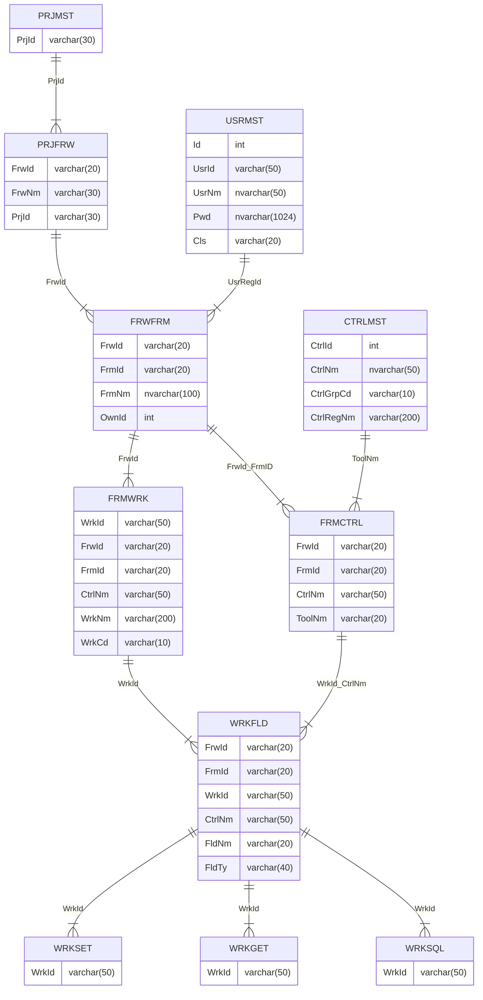

```mermaid
erDiagram

CTRLMST {
CtrlId int
CtrlNm nvarchar(50)
CtrlGrpCd varchar(10)
CtrlRegNm varchar(200)
}

USRMST {
Id int
UsrId varchar(50)
UsrNm nvarchar(50)
Pwd nvarchar(1024)
Cls varchar(20)
}

PRJMST {
PrjId varchar(30)
}

PRJMST ||--|{ PRJFRW : PrjId
PRJFRW {
FrwId varchar(20)
FrwNm varchar(30)
PrjId varchar(30)
}

PRJFRW ||--|{ FRWFRM : FrwId
USRMST ||--|{ FRWFRM : UsrRegId
FRWFRM {
FrwId varchar(20)
FrmId varchar(20)
FrmNm nvarchar(100)
OwnId int
}

FRWFRM ||--|{ FRMWRK : FrwId
FRMWRK {
WrkId varchar(50)
FrwId varchar(20)
FrmId varchar(20)
CtrlNm varchar(50)
WrkNm varchar(200)
WrkCd varchar(10)
}

FRWFRM ||--|{ FRMCTRL : FrwId_FrmID
CTRLMST ||--|{ FRMCTRL : ToolNm
FRMCTRL {
FrwId varchar(20)
FrmId varchar(20)
CtrlNm varchar(50)
ToolNm varchar(20)
}

FRMWRK ||--|{ WRKFLD : WrkId
FRMCTRL ||--|{ WRKFLD : WrkId_CtrlNm
WRKFLD {
FrwId varchar(20)
FrmId varchar(20)
WrkId varchar(50)
CtrlNm varchar(50)
FldNm varchar(20)
FldTy varchar(40)
}

WRKFLD||--|{WRKSET: WrkId
WRKSET{
WrkId varchar(50)
}

WRKFLD||--|{WRKGET: WrkId
WRKGET{
WrkId varchar(50)
}

WRKFLD||--|{WRKSQL: WrkId
WRKSQL{
WrkId varchar(50)
}


```

CTRLMST
USRMST
PRJMST

PRJFRW
FRWFRM
FRMWRK
FRMCTRL
WRKFLD
WRKGET
WRKSET
WRKSQL