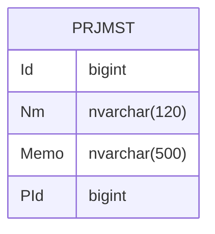

---
#### Prologue / Concept

#### Manifestation


```C#
private long _Id;
public long Id
{
    get => _Id;
    set => Set(ref _Id, value);
}

private string _Nm;
public string Nm
{
    get => _Nm;
    set => Set(ref _Nm, value);
}

private string _Memo;
public string Memo
{
    get => _Memo;
    set => Set(ref _Memo, value);
}

private long _PId;
public long PId
{
    get => _PId;
    set => Set(ref _PId, value);
}


```

```SQL
select a.Id, a.Nm, a.Memo, a.PId, a.CId,
       a.CDt, a.MId, a.MDt
  from PRJMST a
 where 1=1
   and a.Id = @Id
   
insert into PRJMST
      (Id, Nm, Memo, PId, CId,
       CDt, MId, MDt)
select @Id, @Nm, @Memo, @PId, 
       @CId, @CDt, @MId, @MDt
   
update a
   set Id= @Id,
       Nm= @Nm,
       Memo= @Memo,
       PId= @PId,
       CId= @CId,
       CDt= @CDt,
       MId= @MId,
       MDt= @MDt
  from PRJMST a
 where 1=1
   and Id = @Id_old
   
delete
  from PRJMST
 where 1=1
   and Id = @Id_old
```
#### Integration

###### REFERENCE
