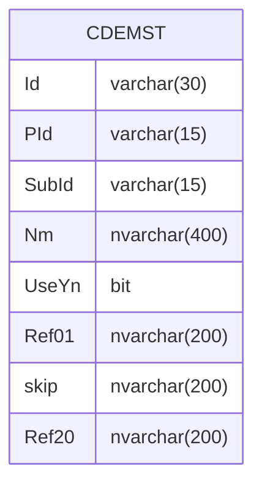

---
#### Prologue / Concept
- [ ] Code System을 구성하면 CDEMST를 View로 구성 #someday [link](https://todoist.com/app/task/8018775531) #todoist %%[todoist_id:: 8018775531]%%
#### Manifestation

##### Model
```C# 
private string _Id;
public string Id
{
    get => _Id;
    set => Set(ref _Id, value);
}

private string _PId;
public string PId
{
    get => _PId;
    set => Set(ref _PId, value);
}

private string _SubId;
public string SubId
{
    get => _SubId;
    set => Set(ref _SubId, value);
}

private string _Nm;
public string Nm
{
    get => _Nm;
    set => Set(ref _Nm, value);
}

private bool _UseYn;
public bool UseYn
{
    get => _UseYn;
    set => Set(ref _UseYn, value);
}

private string _Ref01;
public string Ref01
{
    get => _Ref01;
    set => Set(ref _Ref01, value);
}

private string _Ref02;
public string Ref02
{
    get => _Ref02;
    set => Set(ref _Ref02, value);
}

private string _Ref03;
public string Ref03
{
    get => _Ref03;
    set => Set(ref _Ref03, value);
}

private string _Ref04;
public string Ref04
{
    get => _Ref04;
    set => Set(ref _Ref04, value);
}

private string _Ref05;
public string Ref05
{
    get => _Ref05;
    set => Set(ref _Ref05, value);
}

private string _Ref06;
public string Ref06
{
    get => _Ref06;
    set => Set(ref _Ref06, value);
}

private string _Ref07;
public string Ref07
{
    get => _Ref07;
    set => Set(ref _Ref07, value);
}

private string _Ref08;
public string Ref08
{
    get => _Ref08;
    set => Set(ref _Ref08, value);
}

private string _Ref09;
public string Ref09
{
    get => _Ref09;
    set => Set(ref _Ref09, value);
}

private string _Ref10;
public string Ref10
{
    get => _Ref10;
    set => Set(ref _Ref10, value);
}

private string _Ref11;
public string Ref11
{
    get => _Ref11;
    set => Set(ref _Ref11, value);
}

private string _Ref12;
public string Ref12
{
    get => _Ref12;
    set => Set(ref _Ref12, value);
}

private string _Ref13;
public string Ref13
{
    get => _Ref13;
    set => Set(ref _Ref13, value);
}

private string _Ref14;
public string Ref14
{
    get => _Ref14;
    set => Set(ref _Ref14, value);
}

private string _Ref15;
public string Ref15
{
    get => _Ref15;
    set => Set(ref _Ref15, value);
}

private string _Ref16;
public string Ref16
{
    get => _Ref16;
    set => Set(ref _Ref16, value);
}

private string _Ref17;
public string Ref17
{
    get => _Ref17;
    set => Set(ref _Ref17, value);
}

private string _Ref18;
public string Ref18
{
    get => _Ref18;
    set => Set(ref _Ref18, value);
}

private string _Ref19;
public string Ref19
{
    get => _Ref19;
    set => Set(ref _Ref19, value);
}

private string _Ref20;
public string Ref20
{
    get => _Ref20;
    set => Set(ref _Ref20, value);
}

```

##### SQL
```SQL
select a.Id, a.PId, a.SubId, a.Nm, a.UseYn,
       a.Ref01, a.Ref02, a.Ref03, a.Ref04, a.Ref05,
       a.Ref06, a.Ref07, a.Ref08, a.Ref09, a.Ref10,
       a.Ref11, a.Ref12, a.Ref13, a.Ref14, a.Ref15,
       a.Ref16, a.Ref17, a.Ref18, a.Ref19, a.Ref20,
       a.CId, a.CDt, a.MId, a.MDt
  from CDEMST a
 where 1=1
   and a.Id = @Id
   
insert into CDEMST
      (Id, PId, SubId, Nm, UseYn,
       Ref01, Ref02, Ref03, Ref04, Ref05,
       Ref06, Ref07, Ref08, Ref09, Ref10,
       Ref11, Ref12, Ref13, Ref14, Ref15,
       Ref16, Ref17, Ref18, Ref19, Ref20,
       CId, CDt, MId, MDt)
select @Id, @PId, @SubId, @Nm, @UseYn,
       @Ref01, @Ref02, @Ref03, @Ref04, @Ref05,
       @Ref06, @Ref07, @Ref08, @Ref09, @Ref10,
       @Ref11, @Ref12, @Ref13, @Ref14, @Ref15,
       @Ref16, @Ref17, @Ref18, @Ref19, @Ref20,
       @CId, getdate(), @MId, getdate()
       
update a
   set Id= @Id,
       PId= @PId,
       SubId= @SubId,
       Nm= @Nm,
       UseYn= @UseYn,
       Ref01= @Ref01,
       Ref02= @Ref02,
       Ref03= @Ref03,
       Ref04= @Ref04,
       Ref05= @Ref05,
       Ref06= @Ref06,
       Ref07= @Ref07,
       Ref08= @Ref08,
       Ref09= @Ref09,
       Ref10= @Ref10,
       Ref11= @Ref11,
       Ref12= @Ref12,
       Ref13= @Ref13,
       Ref14= @Ref14,
       Ref15= @Ref15,
       Ref16= @Ref16,
       Ref17= @Ref17,
       Ref18= @Ref18,
       Ref19= @Ref19,
       Ref20= @Ref20,
       MId= @MId,
       MDt= getdate()
  from CDEMST a
 where 1=1
   and Id = @Id_old
   
delete
  from CDEMST
 where 1=1
   and Id = @Id_old
```


#### Integration

###### REFERENCE
