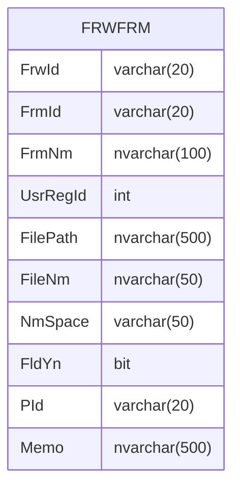

---
#### Prologue / Concept

#### Manifestation

#### Integration


```C#
        private string _FrwId;
        public string FrwId
        {
            get => _FrwId;
            set => Set(ref _FrwId, value);
        }

        private string _FrmId;
        public string FrmId
        {
            get => _FrmId;
            set => Set(ref _FrmId, value);
        }

        private string _FrmNm;
        public string FrmNm
        {
            get => _FrmNm;
            set => Set(ref _FrmNm, value);
        }

        private int _UsrRegId;
        public int UsrRegId
        {
            get => _UsrRegId;
            set => Set(ref _UsrRegId, value);
        }

        private string _FilePath;
        public string FilePath
        {
            get => _FilePath;
            set => Set(ref _FilePath, value);
        }

        private string _FileNm;
        public string FileNm
        {
            get => _FileNm;
            set => Set(ref _FileNm, value);
        }

        private string _NmSpace;
        public string NmSpace
        {
            get => _NmSpace;
            set => Set(ref _NmSpace, value);
        }

        private bool _FldYn;
        public bool FldYn
        {
            get => _FldYn;
            set => Set(ref _FldYn, value);
        }

        private string _PId;
        public string PId
        {
            get => _PId;
            set => Set(ref _PId, value);
        }

        private string _Memo;
        public string Memo
        {
            get => _Memo;
            set => Set(ref _Memo, value);
        }
```

```SQL
select a.FrwId, a.FrmId, a.FrmNm, a.UsrRegId, a.FilePath,
       a.FileNm, a.NmSpace, a.FldYn, a.PId, a.Memo,
       a.CId, a.CDt, a.MId, a.MDt
  from FRWFRM a
 where 1=1
   and a.FrmId = @FrmId
   and a.FrwId = @FrwId
insert into FRWFRM
      (FrwId, FrmId, FrmNm, UsrRegId, FilePath,
       FileNm, NmSpace, FldYn, PId, Memo,
       CId, CDt, MId, MDt)
select @FrwId, @FrmId, @FrmNm, @UsrRegId, @FilePath,
       @FileNm, @NmSpace, @FldYn, @PId, @Memo,
       @CId, @CDt, @MId, @MDt
update a
   set FrwId= @FrwId,
       FrmId= @FrmId,
       FrmNm= @FrmNm,
       UsrRegId= @UsrRegId,
       FilePath= @FilePath,
       FileNm= @FileNm,
       NmSpace= @NmSpace,
       FldYn= @FldYn,
       PId= @PId,
       Memo= @Memo,
       CId= @CId,
       CDt= @CDt,
       MId= @MId,
       MDt= @MDt
  from FRWFRM a
 where 1=1
   and FrmId = @FrmId_old
   and FrwId = @FrwId_old
delete
  from FRWFRM
 where 1=1
   and FrmId = @FrmId_old
   and FrwId = @FrwId_old
```
###### REFERENCE
