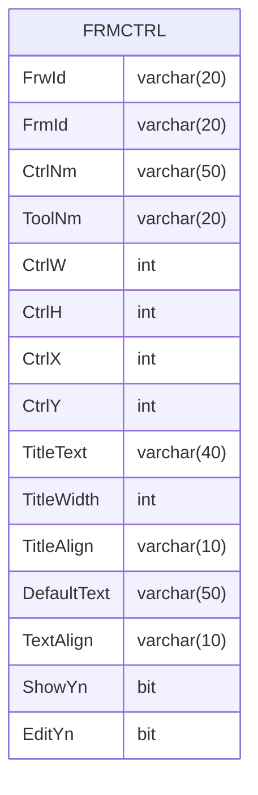

---
#### Prologue / Concept
Controller in Form
#### Manifestation


```C#
private string _FrwId;
public string FrwId
{
    get => _FrwId;
    set => Set(ref _FrwId, value);
}

private string _FrmId;
public string FrmId
{
    get => _FrmId;
    set => Set(ref _FrmId, value);
}

private string _CtrlNm;
public string CtrlNm
{
    get => _CtrlNm;
    set => Set(ref _CtrlNm, value);
}

private string _ToolNm;
public string ToolNm
{
    get => _ToolNm;
    set => Set(ref _ToolNm, value);
}

private int _CtrlW;
public int CtrlW
{
    get => _CtrlW;
    set => Set(ref _CtrlW, value);
}

private int _CtrlH;
public int CtrlH
{
    get => _CtrlH;
    set => Set(ref _CtrlH, value);
}

private int _CtrlX;
public int CtrlX
{
    get => _CtrlX;
    set => Set(ref _CtrlX, value);
}

private int _CtrlY;
public int CtrlY
{
    get => _CtrlY;
    set => Set(ref _CtrlY, value);
}

private string _TitleText;
public string TitleText
{
    get => _TitleText;
    set => Set(ref _TitleText, value);
}

private int _TitleWidth;
public int TitleWidth
{
    get => _TitleWidth;
    set => Set(ref _TitleWidth, value);
}

private string _TitleAlign;
public string TitleAlign
{
    get => _TitleAlign;
    set => Set(ref _TitleAlign, value);
}

private string _DefaultText;
public string DefaultText
{
    get => _DefaultText;
    set => Set(ref _DefaultText, value);
}

private string _TextAlign;
public string TextAlign
{
    get => _TextAlign;
    set => Set(ref _TextAlign, value);
}

private bool _ShowYn;
public bool ShowYn
{
    get => _ShowYn;
    set => Set(ref _ShowYn, value);
}

private bool _EditYn;
public bool EditYn
{
    get => _EditYn;
    set => Set(ref _EditYn, value);
}


```

```SQL
select a.FrwId, a.FrmId, a.CtrlNm, a.ToolNm, a.CtrlW,
       a.CtrlH, a.CtrlX, a.CtrlY, a.TitleText, a.TitleWidth,
       a.TitleAlign, a.DefaultText, a.TextAlign, a.ShowYn, a.EditYn,
       a.CId, a.CDt, a.MId, a.MDt
  from FRMCTRL a
 where 1=1
   and a.FrwId = @FrwId
   and a.FrmId = @FrmId
   and a.CtrlNm = @CtrlNm

insert into FRMCTRL
      (FrwId, FrmId, CtrlNm, ToolNm, CtrlW,
       CtrlH, CtrlX, CtrlY, TitleText, TitleWidth,
       TitleAlign, DefaultText, TextAlign, ShowYn, EditYn,
       CId, CDt, MId, MDt)
select @FrwId, @FrmId, @CtrlNm, @ToolNm, @CtrlW,
       @CtrlH, @CtrlX, @CtrlY, @TitleText, @TitleWidth,
       @TitleAlign, @DefaultText, @TextAlign, @ShowYn, @EditYn,
       <$gRegId>, getdate(), <$gRegId>, getdate()

update a
   set FrwId= @FrwId,
       FrmId= @FrmId,
       CtrlNm= @CtrlNm,
       ToolNm= @ToolNm,
       CtrlW= @CtrlW,
       CtrlH= @CtrlH,
       CtrlX= @CtrlX,
       CtrlY= @CtrlY,
       TitleText= @TitleText,
       TitleWidth= @TitleWidth,
       TitleAlign= @TitleAlign,
       DefaultText= @DefaultText,
       TextAlign= @TextAlign,
       ShowYn= @ShowYn,
       EditYn= @EditYn,
       MId= <$gRegId>,
       MDt= getdate()
  from FRMCTRL a
 where 1=1
   and FrwId = @FrwId
   and FrmId = @FrmId
   and CtrlNm = @CtrlNm

delete
  from FRMCTRL
 where 1=1
   and FrwId = @FrwId
   and FrmId = @FrmId
   and CtrlNm = @CtrlNm
```
#### Integration

###### REFERENCE

grdFrmCtrl

grdWrkFld