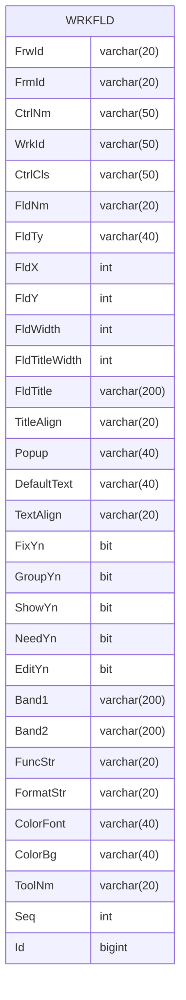

---
#### Prologue / Concept
FRMCTRL에서 WRKFLD로 전환
0. Form Load를 실행

1. FRMCTRL를 기초로 WRKFLD 생성 - 첫번째 행위 
2. VS 수정 사항을 반영
	1. Form Load


VS - FORM DESIGN
FRMLOD - FORM LOAD
FRMLOD(FRMWRK) - WORKSET REGISTRATION(DATASET Only, Others Auto)
WRKREPO - MODELDEFINE - SELECT QUERY
WRKBIND - BINDING INFO
VS - MODEL REGISTRATION
FRW- BUSINESS LOGIC
FORM REGISTRATION
MENU REGISTRATION

SOURCE->BINDING
WrkId, CtrlNm, FldNm이 기입되면 바인딩 되었다. 


#### Manifestation
##### FRMCTRL->WRKFLD
```SQL
insert into WRKFLD
      (FrwId, FrmId, CtrlNm, WrkId, CtrlCls,
       FldNm, FldTy, FldX, FldY, FldWidth,
       FldTitleWidth, FldTitle, TitleAlign, Popup, DefaultText,
       TextAlign, FixYn, GroupYn, ShowYn, NeedYn,
       EditYn, Band1, Band2, FuncStr, FormatStr,
       ColorFont, ColorBg, Seq, CId,
       CDt, MId, MDt)
select FrwId, FrmId, 
       CtrlNm, 
       WrkId=null, 
       CtrlCls=null,
       FldNm=CtrlNm, FldTy=null, FldX=CtrlX, FldY=CtrlY, FldWidth=CtrlW,
       FldTitleWidth=TitleWidth, FldTitle=TitleText, TitleAlign=TitleAlign, Popup=null, DefaultText,
       TextAlign=TextAlign, FixYn=null, GroupYn=null, ShowYn=ShowYn, NeedYn=null,
       EditYn=EditYn, Band1=null, Band2=null, FuncStr=null, FormatStr=null,
       ColorFont=null, ColorBg=null, Seq=null, CId,
       CDt, MId, MDt
  from FRMCTRL a
```

#### Integration

![[Pasted image 20240527215405.png]]
CtrlCls = Binding, Column, null
FldTy
	1. DataType에 따른 Format이 결정
		1. Decimal, Int, Date, DateTime
	2. Data입력방식에 따른 결정
		1. Text, TextButton, Combo, Code, Date
	3. 컬럼의 DisplayFormat 입력
		1. column.DisplayFormat.FormatString

##### Table


```SQL
select a.FrwId, a.FrmId, a.CtrlNm, a.WrkId, a.CtrlCls,
       a.FldNm, a.FldTy, a.FldX, a.FldY, a.FldWidth,
       a.FldTitleWidth, a.FldTitle, a.TitleAlign, a.Popup, a.DefaultText,
       a.TextAlign, a.FixYn, a.GroupYn, a.ShowYn, a.NeedYn,
       a.EditYn, a.Band1, a.Band2, a.FuncStr, a.FormatStr,
       a.ColorFont, a.ColorBg, a.ToolNm, a.Seq, a.Id,
       a.CId, a.CDt, a.MId, a.MDt
  from WRKFLD a
 where 1=1
   and a.CtrlNm = @CtrlNm
   and a.FrmId = @FrmId
   and a.FrwId = @FrwId
   
insert into WRKFLD
      (FrwId, FrmId, CtrlNm, WrkId, CtrlCls,
       FldNm, FldTy, FldX, FldY, FldWidth,
       FldTitleWidth, FldTitle, TitleAlign, Popup, DefaultText,
       TextAlign, FixYn, GroupYn, ShowYn, NeedYn,
       EditYn, Band1, Band2, FuncStr, FormatStr,
       ColorFont, ColorBg, ToolNm, Seq, Id,
       CId, CDt, MId, MDt)
select @FrwId, @FrmId, @CtrlNm, @WrkId, @CtrlCls,
       @FldNm, @FldTy, @FldX, @FldY, @FldWidth,
       @FldTitleWidth, @FldTitle, @TitleAlign, @Popup, @DefaultText,
       @TextAlign, @FixYn, @GroupYn, @ShowYn, @NeedYn,
       @EditYn, @Band1, @Band2, @FuncStr, @FormatStr,
       @ColorFont, @ColorBg, @ToolNm, @Seq, @Id,
       @CId, @CDt, @MId, @MDt
       
update a
   set FrwId= @FrwId,
       FrmId= @FrmId,
       CtrlNm= @CtrlNm,
       WrkId= @WrkId,
       CtrlCls= @CtrlCls,
       FldNm= @FldNm,
       FldTy= @FldTy,
       FldX= @FldX,
       FldY= @FldY,
       FldWidth= @FldWidth,
       FldTitleWidth= @FldTitleWidth,
       FldTitle= @FldTitle,
       TitleAlign= @TitleAlign,
       Popup= @Popup,
       DefaultText= @DefaultText,
       TextAlign= @TextAlign,
       FixYn= @FixYn,
       GroupYn= @GroupYn,
       ShowYn= @ShowYn,
       NeedYn= @NeedYn,
       EditYn= @EditYn,
       Band1= @Band1,
       Band2= @Band2,
       FuncStr= @FuncStr,
       FormatStr= @FormatStr,
       ColorFont= @ColorFont,
       ColorBg= @ColorBg,
       ToolNm= @ToolNm,
       Seq= @Seq,
       Id= @Id,
       CId= @CId,
       CDt= @CDt,
       MId= @MId,
       MDt= @MDt
  from WRKFLD a
 where 1=1
   and CtrlNm = @CtrlNm_old
   and FrmId = @FrmId_old
   and FrwId = @FrwId_old
   
delete
  from WRKFLD
 where 1=1
   and CtrlNm = @CtrlNm_old
   and FrmId = @FrmId_old
   and FrwId = @FrwId_old
```

##### Model
```C#
private string _FrwId;
public string FrwId
{
    get => _FrwId;
    set => Set(ref _FrwId, value);
}

private string _FrmId;
public string FrmId
{
    get => _FrmId;
    set => Set(ref _FrmId, value);
}

private string _CtrlNm;
public string CtrlNm
{
    get => _CtrlNm;
    set => Set(ref _CtrlNm, value);
}

private string _WrkId;
public string WrkId
{
    get => _WrkId;
    set => Set(ref _WrkId, value);
}

private string _CtrlCls;
public string CtrlCls
{
    get => _CtrlCls;
    set => Set(ref _CtrlCls, value);
}

private string _FldNm;
public string FldNm
{
    get => _FldNm;
    set => Set(ref _FldNm, value);
}

private string _FldTy;
public string FldTy
{
    get => _FldTy;
    set => Set(ref _FldTy, value);
}

private int _FldX;
public int FldX
{
    get => _FldX;
    set => Set(ref _FldX, value);
}

private int _FldY;
public int FldY
{
    get => _FldY;
    set => Set(ref _FldY, value);
}

private int _FldWidth;
public int FldWidth
{
    get => _FldWidth;
    set => Set(ref _FldWidth, value);
}

private int _FldTitleWidth;
public int FldTitleWidth
{
    get => _FldTitleWidth;
    set => Set(ref _FldTitleWidth, value);
}

private string _FldTitle;
public string FldTitle
{
    get => _FldTitle;
    set => Set(ref _FldTitle, value);
}

private string _TitleAlign;
public string TitleAlign
{
    get => _TitleAlign;
    set => Set(ref _TitleAlign, value);
}

private string _Popup;
public string Popup
{
    get => _Popup;
    set => Set(ref _Popup, value);
}

private string _DefaultText;
public string DefaultText
{
    get => _DefaultText;
    set => Set(ref _DefaultText, value);
}

private string _TextAlign;
public string TextAlign
{
    get => _TextAlign;
    set => Set(ref _TextAlign, value);
}

private bool _FixYn;
public bool FixYn
{
    get => _FixYn;
    set => Set(ref _FixYn, value);
}

private bool _GroupYn;
public bool GroupYn
{
    get => _GroupYn;
    set => Set(ref _GroupYn, value);
}

private bool _ShowYn;
public bool ShowYn
{
    get => _ShowYn;
    set => Set(ref _ShowYn, value);
}

private bool _NeedYn;
public bool NeedYn
{
    get => _NeedYn;
    set => Set(ref _NeedYn, value);
}

private bool _EditYn;
public bool EditYn
{
    get => _EditYn;
    set => Set(ref _EditYn, value);
}

private string _Band1;
public string Band1
{
    get => _Band1;
    set => Set(ref _Band1, value);
}

private string _Band2;
public string Band2
{
    get => _Band2;
    set => Set(ref _Band2, value);
}

private string _FuncStr;
public string FuncStr
{
    get => _FuncStr;
    set => Set(ref _FuncStr, value);
}

private string _FormatStr;
public string FormatStr
{
    get => _FormatStr;
    set => Set(ref _FormatStr, value);
}

private string _ColorFont;
public string ColorFont
{
    get => _ColorFont;
    set => Set(ref _ColorFont, value);
}

private string _ColorBg;
public string ColorBg
{
    get => _ColorBg;
    set => Set(ref _ColorBg, value);
}

private string _ToolNm;
public string ToolNm
{
    get => _ToolNm;
    set => Set(ref _ToolNm, value);
}

private int _Seq;
public int Seq
{
    get => _Seq;
    set => Set(ref _Seq, value);
}

private long _Id;
public long Id
{
    get => _Id;
    set => Set(ref _Id, value);
}


```
##### Repository
```C#
    public interface IWrkFldRepo
    {
        List<WrkFld> GetByFrwFrmWrk(string frwId, string frmId, string wrkId);
        void Add(WrkFld wrkFld);
        void Update(WrkFld wrkFld);
        void Delete(WrkFld wrkFld);
    }
```


##### 추가개발
- [ ] FldTab 등 컨트롤러별 추가 속성에 대한 정의 #someday [link](https://todoist.com/app/task/8009132458) #todoist %%[todoist_id:: 8009132458]%% 
	아래의 내용은 FldTab을 만들면 구현하도록 한다. Ctrl.UcTab 
	```C#
	tabCtrl.HeaderLocation = DevExpress.XtraTab.TabHeaderLocation.Top;
	tabCtrl.HeaderButtons = DevExpress.XtraTab.TabButtons.Default;
	```

colproperty.FrwId
colproperty.FrmId
colproperty.CtrlNm
colproperty.WrkId
colproperty.CtrlCls
colproperty.FldNm
colproperty.FldTy
colproperty.FldX
colproperty.FldY
colproperty.FldWidth
colproperty.FldTitleWidth
colproperty.FldTitle
colproperty.TitleAlign
colproperty.Popup
colproperty.DefaultText
colproperty.TextAlign
colproperty.FixYn
colproperty.GroupYn
colproperty.ShowYn
colproperty.NeedYn
colproperty.EditYn
colproperty.Band1
colproperty.Band2
colproperty.FuncStr
colproperty.FormatStr
colproperty.ColorFont
colproperty.ColorBg
colproperty.ToolNm
colproperty.Seq
colproperty.Id