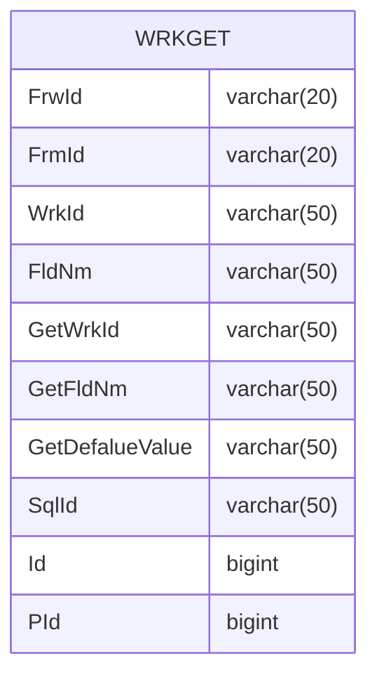

---
#### Prologue / Concept

#### Manifestation

WRKFLD


```C#
private string _FrwId;
public string FrwId
{
    get => _FrwId;
    set => Set(ref _FrwId, value);
}

private string _FrmId;
public string FrmId
{
    get => _FrmId;
    set => Set(ref _FrmId, value);
}

private string _WrkId;
public string WrkId
{
    get => _WrkId;
    set => Set(ref _WrkId, value);
}

private string _FldNm;
public string FldNm
{
    get => _FldNm;
    set => Set(ref _FldNm, value);
}

private string _GetWrkId;
public string GetWrkId
{
    get => _GetWrkId;
    set => Set(ref _GetWrkId, value);
}

private string _GetFldNm;
public string GetFldNm
{
    get => _GetFldNm;
    set => Set(ref _GetFldNm, value);
}

private string _GetDefalueValue;
public string GetDefalueValue
{
    get => _GetDefalueValue;
    set => Set(ref _GetDefalueValue, value);
}

private string _SqlId;
public string SqlId
{
    get => _SqlId;
    set => Set(ref _SqlId, value);
}

private long _Id;
public long Id
{
    get => _Id;
    set => Set(ref _Id, value);
}

private long _PId;
public long PId
{
    get => _PId;
    set => Set(ref _PId, value);
}

```

```SQL
select a.FrwId, a.FrmId, a.WrkId, a.FldNm, a.GetWrkId,
       a.GetFldNm, a.GetDefalueValue, a.SqlId, a.Id, a.PId,
       a.CId, a.CDt, a.MId, a.MDt
  from WRKGET a
 where 1=1
   and a.FldNm = @FldNm
   and a.FrmId = @FrmId
   and a.FrwId = @FrwId
   and a.WrkId = @WrkId
   
insert into WRKGET
      (FrwId, FrmId, WrkId, FldNm, GetWrkId,
       GetFldNm, GetDefalueValue, SqlId, Id, PId,
       CId, CDt, MId, MDt)
select @FrwId, @FrmId, @WrkId, @FldNm, @GetWrkId,
       @GetFldNm, @GetDefalueValue, @SqlId, @Id, @PId,
       @CId, @CDt, @MId, @MDt
update a
   set FrwId= @FrwId,
       FrmId= @FrmId,
       WrkId= @WrkId,
       FldNm= @FldNm,
       GetWrkId= @GetWrkId,
       GetFldNm= @GetFldNm,
       GetDefalueValue= @GetDefalueValue,
       SqlId= @SqlId,
       Id= @Id,
       PId= @PId,
       CId= @CId,
       CDt= @CDt,
       MId= @MId,
       MDt= @MDt
  from WRKGET a
 where 1=1
   and FldNm = @FldNm_old
   and FrmId = @FrmId_old
   and FrwId = @FrwId_old
   and WrkId = @WrkId_old
delete
  from WRKGET
 where 1=1
   and FldNm = @FldNm_old
   and FrmId = @FrmId_old
   and FrwId = @FrwId_old
   and WrkId = @WrkId_old
```


#### Integration

###### REFERENCE
