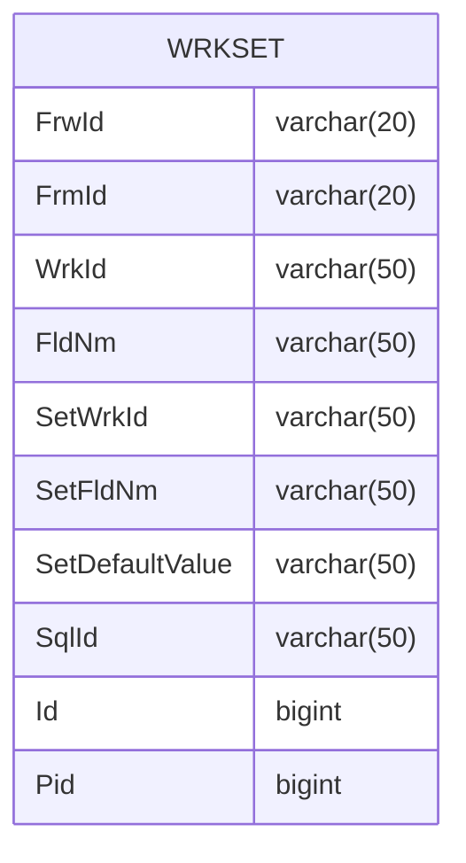

---
#### Prologue / Concept

#### Manifestation



```C#
private string _FrwId;
public string FrwId
{
    get => _FrwId;
    set => Set(ref _FrwId, value);
}

private string _FrmId;
public string FrmId
{
    get => _FrmId;
    set => Set(ref _FrmId, value);
}

private string _WrkId;
public string WrkId
{
    get => _WrkId;
    set => Set(ref _WrkId, value);
}

private string _FldNm;
public string FldNm
{
    get => _FldNm;
    set => Set(ref _FldNm, value);
}

private string _SetWrkId;
public string SetWrkId
{
    get => _SetWrkId;
    set => Set(ref _SetWrkId, value);
}

private string _SetFldNm;
public string SetFldNm
{
    get => _SetFldNm;
    set => Set(ref _SetFldNm, value);
}

private string _SetDefaultValue;
public string SetDefaultValue
{
    get => _SetDefaultValue;
    set => Set(ref _SetDefaultValue, value);
}

private string _SqlId;
public string SqlId
{
    get => _SqlId;
    set => Set(ref _SqlId, value);
}

private long _Id;
public long Id
{
    get => _Id;
    set => Set(ref _Id, value);
}

private long _Pid;
public long Pid
{
    get => _Pid;
    set => Set(ref _Pid, value);
}


```

```SQL
select a.FrwId, a.FrmId, a.WrkId, a.FldNm, a.SetWrkId,
       a.SetFldNm, a.SetDefaultValue, a.SqlId, a.Id, a.Pid,
       a.CId, a.CDt, a.MId, a.MDt
  from WRKSET a
 where 1=1
   and a.FldNm = @FldNm
   and a.FrmId = @FrmId
   and a.FrwId = @FrwId
   and a.WrkId = @WrkId
insert into WRKSET
      (FrwId, FrmId, WrkId, FldNm, SetWrkId,
       SetFldNm, SetDefaultValue, SqlId, Id, Pid,
       CId, CDt, MId, MDt)
select @FrwId, @FrmId, @WrkId, @FldNm, @SetWrkId,
       @SetFldNm, @SetDefaultValue, @SqlId, @Id, @Pid,
       @CId, @CDt, @MId, @MDt
update a
   set FrwId= @FrwId,
       FrmId= @FrmId,
       WrkId= @WrkId,
       FldNm= @FldNm,
       SetWrkId= @SetWrkId,
       SetFldNm= @SetFldNm,
       SetDefaultValue= @SetDefaultValue,
       SqlId= @SqlId,
       Id= @Id,
       Pid= @Pid,
       CId= @CId,
       CDt= @CDt,
       MId= @MId,
       MDt= @MDt
  from WRKSET a
 where 1=1
   and FldNm = @FldNm_old
   and FrmId = @FrmId_old
   and FrwId = @FrwId_old
   and WrkId = @WrkId_old
delete
  from WRKSET
 where 1=1
   and FldNm = @FldNm_old
   and FrmId = @FrmId_old
   and FrwId = @FrwId_old
   and WrkId = @WrkId_old
```


#### Integration

###### REFERENCE
